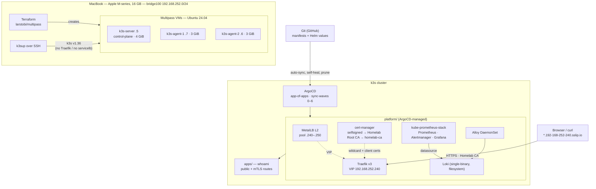

# Cluster Kubernetes personnel (Homelab) — GitOps de bout en bout

A personal, end-to-end **GitOps homelab**: a multi-node **k3s** cluster
provisioned with **Terraform**, with every workload and platform add-on delivered
by **ArgoCD** syncing from Git. Ingress via **Traefik**, TLS/mTLS via
**cert-manager**, load-balancing via **MetalLB**, DNS via **Cloudflare**
(or `sslip.io` while free), and observability via **Prometheus / Grafana / Loki**.
Cluster supervision with **Lens**.

> Status: **runs end to end on a 16 GB Apple-silicon Mac.** 14/14 ArgoCD
> applications Synced + Healthy; HTTPS + mTLS on every route; 29/29 Prometheus
> targets up; Loki ingesting logs from all namespaces.

---

## What this project does

| Capability | How |
|---|---|
| **Infrastructure as code** | `terraform/` creates 3 Ubuntu VMs (Multipass) — 1 server + 2 agents — with cloud-init (SSH key, sysctl, swap off). |
| **Cluster install** | `k3sup` installs k3s v1.36 over SSH; k3s's bundled Traefik and ServiceLB are **disabled** so the platform layer owns them in Git. |
| **GitOps delivery** | One imperative step (`bootstrap/`) installs ArgoCD; after that an **app-of-apps** (`argocd/`) with **sync-waves** reconciles everything — including ArgoCD itself — from `main`. Auto-sync, self-heal, prune. |
| **Load balancing** | MetalLB (L2) hands the Multipass subnet a VIP; Traefik's `LoadBalancer` Service is pinned to `192.168.252.240`. |
| **Ingress** | Traefik v3 `IngressRoute`s for ArgoCD, Grafana, Prometheus, Alertmanager, the Traefik dashboard, and the demo app on `*.192-168-252-240.sslip.io`. HTTP→HTTPS redirect, HSTS + hardening middleware, basic-auth on the raw dashboards. |
| **TLS** | cert-manager chain: `selfsigned` → **Homelab Root CA** → `homelab-ca` ClusterIssuer → a wildcard leaf cert served as Traefik's default. |
| **mTLS** | A `TLSOption` with `RequireAndVerifyClientCert`; the `whoami-mtls` route refuses connections without a client cert signed by the Homelab CA. |
| **Metrics & alerts** | `kube-prometheus-stack` (Prometheus + Alertmanager + Grafana + node-exporter + kube-state-metrics), tuned for the RAM budget; k3s-absent control-plane scrapes disabled; 6 custom `homelab.*` alert rules. |
| **Logs** | Loki (single-binary, filesystem) + a Grafana **Alloy** DaemonSet tailing every pod's logs via the Kubernetes API and pushing to Loki. |
| **Dashboards as code** | Grafana runs stateless; datasources (Prometheus/Loki/Alertmanager) and a "Homelab / Cluster Overview" dashboard are provisioned from ConfigMaps. |
| **Secrets discipline** | Every credential in Git is a `*.example.yaml` placeholder; real secrets (`dashboard-auth`, `grafana-admin`, a future `cloudflare-api-token`) are created out-of-band. `sops` + `age` are installed for encrypting them into Git later. |
| **Path to public TLS** | `letsencrypt-staging` / `letsencrypt-prod` ClusterIssuers with the **Cloudflare DNS-01** solver are written and committed as `*.example.yaml` — activating them is a `git mv`, a zone name, and an API token. |

---

## Architecture



### Sync-wave order (app-of-apps)

| Wave | Applications | Gate it provides |
|-----:|--------------|------------------|
| 0 | `metallb` | MetalLB CRDs + speakers |
| 1 | `metallb-config`, `cert-manager` | LB IP pool; cert-manager CRDs + webhook |
| 2 | `cert-manager-issuers`, `traefik` | ClusterIssuers; Traefik CRDs + LB Service |
| 3 | `traefik-config`, `argocd` (self-manage) | wildcard cert, TLSStore, TLSOptions |
| 4 | `kube-prometheus-stack`, `loki` | Prometheus-operator CRDs; log store |
| 5 | `alloy`, `observability-extras` | log shipping; ServiceMonitors, PrometheusRules, dashboard |
| 6 | `ingress`, `demo` | all IngressRoutes; sample workload |

ArgoCD promotes to the next wave only when every app in the current wave is
Synced + Healthy — that is what serialises "CRDs before the resources that use them".

---

## Repository layout

```
terraform/     VM provisioning (larstobi/multipass) + cloud-init template
scripts/       provision-k3s.sh · set-repo.sh · trust-ca.sh · demo-client-cert.sh
bootstrap/     one-time: helm install argocd + argo-cd Helm values
argocd/        root.yaml (app-of-apps) + argocd/apps/NN-*.yaml (one Application each)
platform/      metallb · cert-manager · traefik · observability · ingress
                 (Helm values + raw manifests, referenced by the Applications)
apps/          demo/ — traefik/whoami Deployment, Service, IngressRoutes, client cert
docs/          architecture.md (mermaid) · runbook.md (bring-up + failure modes)
Makefile       every workflow: init/up/k3s/argocd-bootstrap/apps/sync/urls/down/clean
```

### Pinned versions

| Component | Chart | App |
| --- | --- | --- |
| ArgoCD | argo-cd 10.6.4 | v3.5.2 |
| MetalLB | metallb 0.16.1 | v0.16.1 |
| cert-manager | cert-manager v1.21.1 | v1.21.1 |
| Traefik | traefik 41.4.0 | v3.7.12 |
| kube-prometheus-stack | 88.6.2 | Prometheus-operator v0.93.1 |
| Loki | loki 7.3.0 | 3.6.12 |
| Alloy | alloy 1.12.1 | v1.19.2 |
| k3s | — | v1.36.4+k3s1 |

---

## Run it yourself

### Prerequisites

```bash
brew install terraform helm k3sup argocd kubectx k9s yq sops age gh
brew install --cask multipass lens
```

An SSH key at `~/.ssh/id_ed25519` (used by `k3sup`). On macOS, grant **Local
Network** permission to the terminal app / VS Code / Lens, or they cannot reach
the VMs.

Default node size: **server 4 GiB, agents 3 GiB**, 2 vCPU, 12 GiB disk
(10 GiB total RAM — the full observability stack OOM-kills the API server at
3×2 GiB). Tune in `terraform/variables.tf`.

### Phase 1–2 — cluster

```bash
make init
make up            # 3 Multipass VMs, created serially (avoids the macOS DHCP race)
make k3s           # k3sup installs k3s, writes ./kubeconfig
export KUBECONFIG=$PWD/kubeconfig
make nodes         # 3x Ready
```

### Phase 4+ — GitOps

```bash
gh repo create cluster_kubernetes_personnel --public --source=. --remote=origin --push
make set-repo                          # bake the repo URL into the Application manifests
git commit -am "set gitops repo url" && git push

# out-of-band secrets (not in Git) — see docs/runbook.md step 3
kubectl create ns traefik ; kubectl create ns observability
htpasswd -nbBC 10 admin 'PW1' | kubectl -n traefik create secret generic dashboard-auth --from-file=users=/dev/stdin
kubectl -n observability create secret generic grafana-admin --from-literal=admin-user=admin --from-literal=admin-password='PW2'

make argocd-bootstrap                  # helm install argocd + apply the root app
watch make apps                        # 14/14 -> Synced / Healthy  (~8–12 min)
make trust-ca                          # add the Homelab Root CA to the macOS keychain
make urls
```

The repo must be **public** (or give ArgoCD repository credentials).

### Endpoints (`make urls`)

```text
https://{argocd,grafana,prometheus,alertmanager,traefik,whoami,whoami-mtls}.192-168-252-240.sslip.io
```

| Service | User | Password source |
|---|---|---|
| ArgoCD | `admin` | `make argocd-password` |
| Grafana | `admin` | secret `observability/grafana-admin` |
| Prometheus / Alertmanager / Traefik | `admin` | secret `traefik/dashboard-auth` |

### mTLS demo

```bash
make demo-client-cert
curl --cacert homelab-ca.crt --cert demo-client.crt --key demo-client.key \
  https://whoami-mtls.192-168-252-240.sslip.io          # 200
curl --cacert homelab-ca.crt https://whoami-mtls.192-168-252-240.sslip.io   # handshake refused
```

### Lifecycle

| | |
|---|---|
| Pause (keep disks) | `multipass stop --all` |
| Resume | `multipass start --all` |
| Destroy VMs | `make down` |
| Destroy + local artifacts | `make clean` |

---

## What was built & achieved

- **54 manifest/Helm-values/Terraform files**, a 13-Application app-of-apps, and a
  `make` target for every step of the lifecycle.
- **Terraform → k3s → ArgoCD → the whole platform**, brought up from nothing and
  verified: 14/14 apps Synced + Healthy, all pods Running, 3 PVCs bound on the
  k3s `local-path` provisioner.
- **Working TLS story end to end** — a self-signed Homelab Root CA issuing a
  wildcard cert (served as Traefik's default via a `TLSStore`) and client certs;
  **mTLS enforced** on a dedicated route and proven both ways (`200` with a client
  cert, handshake refused without).
- **Full observability** — Prometheus scraping 29/29 targets with 6 homelab-
  specific alert rules, Grafana running stateless with code-provisioned
  datasources + dashboard, Loki receiving pod logs from every namespace via Alloy.
- **Real debugging, folded back into the repo** (6 commits):
  - private repo → ArgoCD `Repository not found` → made public;
  - a `TLSOption` literally named `default` is special-cased by Traefik and
    cannot be referenced → routes use `tls: {}`;
  - a Grafana PVC pinned the admin password from first boot → Grafana is now
    stateless with `admin.existingSecret`;
  - kube-prometheus-stack's self-deleting admission-webhook Jobs read as drift →
    given ArgoCD `PreSync` hook annotations;
  - dormant Let's Encrypt issuers sat `Degraded` without a token → moved to
    `*.example.yaml` (excluded from sync);
  - 3×2 GiB OOM-killed the API server → defaults raised to 4/3/3 GiB;
  - `mapfile` isn't in macOS's bash 3.2 → portable loop.
  All captured in [docs/runbook.md](docs/runbook.md).

### Not done (deliberately out of scope for a free/offline lab)

- **Cloudflare + Let's Encrypt** — the DNS-01 ClusterIssuers are written and
  committed; they need a real domain + API token to activate (`git mv` the
  `*.example.yaml`, set the zone, create the secret). Steps in the runbook.
- HA control plane, real persistent storage backend, backups.

---

## Docs

- [docs/architecture.md](docs/architecture.md) — diagram, request path, design choices.
- [docs/runbook.md](docs/runbook.md) — bring-up, daily ops, every failure mode hit, and the Cloudflare/Let's Encrypt cutover.
