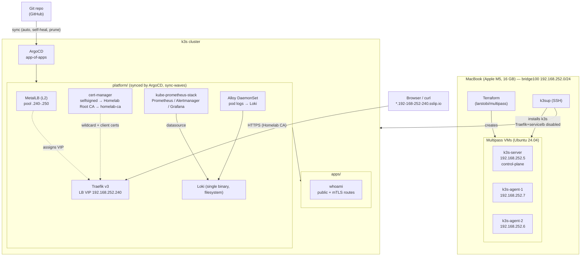

# Architecture

## Layers

## Request path

`https://grafana.192-168-252-240.sslip.io`
→ `sslip.io` resolves the host to `192.168.252.240`
→ MetalLB answers ARP for `.240` on `bridge100`, forwards to the Traefik pod
→ Traefik terminates TLS with the wildcard cert (`*.192-168-252-240.sslip.io`, signed by the Homelab Root CA)
→ `IngressRoute` in ns `traefik` routes to `kube-prometheus-stack-grafana.observability:80`.

The mTLS route additionally requires a client cert signed by the Homelab CA
(`TLSOption/mtls`, `clientAuthType: RequireAndVerifyClientCert`).

## Sync waves (app-of-apps ordering)

| Wave | Applications | Gate it provides |
|-----:|--------------|------------------|
| 0 | `metallb` | MetalLB CRDs + speakers |
| 1 | `metallb-config`, `cert-manager` | LB IP pool; cert-manager CRDs + webhook |
| 2 | `cert-manager-issuers`, `traefik` | ClusterIssuers; Traefik CRDs + LB service |
| 3 | `traefik-config`, `argocd` (self-manage) | wildcard cert, TLSStore, TLSOptions |
| 4 | `kube-prometheus-stack`, `loki` | Prometheus operator CRDs; log store |
| 5 | `alloy`, `observability-extras` | log shipping; ServiceMonitors, PrometheusRules, dashboards |
| 6 | `ingress`, `demo` | all IngressRoutes; sample workload |

ArgoCD promotes to the next wave only when every Application in the current wave
is Synced + Healthy, which is what serializes "CRDs before CRs".

## Deliberate choices

- **k3s Traefik + servicelb disabled** at install — the platform layer owns ingress
  and load-balancing so they are versioned in Git, not pinned to the k3s release.
- **Self-signed CA, not Let's Encrypt** — works offline and with `sslip.io`, and
  exercises the full chain (root CA → leaf → trust store) plus mTLS. The
  `letsencrypt-staging` / `letsencrypt-prod` ClusterIssuers with the Cloudflare
  DNS-01 solver are committed but dormant; wiring a real domain is a token + a
  zone name.
- **Loki single-binary / filesystem** — the microservice/object-store layout wants
  several GB of RAM the 16 GB host doesn't have.
- **Everything after ArgoCD is `git push`** — `bootstrap/` is the only imperative step.
